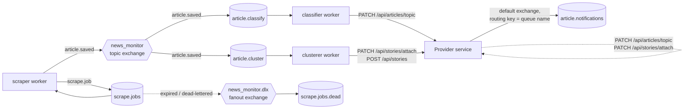

# News Monitor : Complete System Architecture

**News Monitor** is a distributed, backend news processing pipeline designed to ingest, classify, and cluster news articles into stories. The system separates concerns across three independent services : a user-facing manager, a data provider, and a set of Python workers, connected by HTTP and RabbitMQ, each owning its own datastore. This document is the complete, single source of truth for understanding the entire system.

**For detailed API endpoints and schemas, see:** [`PROVIDER_API.md`](PROVIDER_API.md) and [`MANAGER_API.md`](MANAGER_API.md).

---

## Architecture Evolution

### Phase 1: Java Monolith with Embedded Threads (The Starting Point)

The system began as a single Spring Boot monolith in Java, connected only to PostgreSQL. The pipeline ran as background threads within the same JVM:

- **One process** bundled everything: user accounts, web APIs, news scraping, classification, and clustering.
- **Thread pool** inside the monolith orchestrated the pipeline stages.
- **PostgreSQL only** : everything (users, articles, classifications, clusters) lived in a single relational database.
- **Two simplistic Python workers** existed but were loosely coupled, handling only basic tasks.

**The problem:** As article volume grew, competing workloads fought for resources. A heavy classification task could starve the web server, and a stuck classification thread could block scraping jobs. Scaling was bottlenecked by the monolith's single process boundary.

### Phase 2: Decoupled Worker Types (Breaking Apart the Threads)

The next iteration realized that scraping, classifying, and clustering were fundamentally different workloads:

- **Three dedicated sraping Java workers** replaced the embedded threads, each in its own process.
- **Shallow scraping** (RSS feed only) was still used since Java libraries for web scraping are limited.
- **REST API python workers** are used for classification and embeddings/clustering.

### Phase 3: Specialized Datastores and Workers(From One to Three)

The current design abandons the monolithic database:

- **Python web scraping** : The former java scrapers were converted to python for true web scraping.
- **RabbitMQ** became the communication backbone: jobs flow through queues, decoupling producer from consumer.
- **RabbitMQ clients** : the former REST API python workers were replaced with RabbitMQ consumers in order to allow async computation.
- **One queue per worker type:** `scrape.jobs` => scraper worker, `article.classify` => classifier worker, `article.cluster` => clusterer worker.
- **Fan-out pattern:** the scraper publishes one event (`article.saved`), and a topic exchange fans it to both classification and clustering queues, allowing them to run independently.
- **PostgreSQL** (manager) - user accounts, subscriptions, and notifications. High-consistency relational data.
- **Neo4j** (provider) - articles, sources, topics, and stories.
- **Qdrant** (clusterer worker) - one vector collection holding story centroids. Efficient nearest-neighbor search for clustering decisions.

Vectors and structured data have different access patterns. Embedding 384-dim vectors into Neo4j as properties would be both slow and wasteful. Qdrant's ANN index makes "find the closest story" O(log n) instead of O(n), and its specialized hardware support means clustering stays fast as article volume grows.

**The tradeoff:** No FK constraints across databases. Consistency is maintained at the application layer-each service owns its data and validates foreign references via HTTP before trusting them.

### Why This Arhitecture

1. **User accounts** are central to auth (manager issues all JWTs), so they can't be distributed. PostgreSQL is ideal.
2. **Articles and stories** form a graph (article => topic, article => story, story => article => source). Neo4j models this naturally, SQL would require many JOINs.
3. **Vector similarity search** is the only reason clustering works at all. Qdrant exists because Neo4j's full-text indexes can't do cosine-similarity nearest-neighbor efficiently.

---

## System Overview

### Architectural Decisions

**1. Three independent datastores, one per role**

- Manager owns user accounts (Postgres).
- Provider is system-of-record for articles/stories/topics/sources (Neo4j).
- Clusterer worker owns story vectors (Qdrant).

**2. Provider = single read/write gateway for all structured data**

- Scraper, classifier, clusterer workers never touch Neo4j directly.
- All write operations go through the Provider's REST API, enforcing consistency.
- This is why the Provider is "the news broker".

**3. Async pipeline with RabbitMQ, sync subscription checks**

- **Async:** scraper => classify/cluster workers (via queues). Scraping never waits for classification.
- **Sync:** user subscribes => manager calls provider to verify the topic/story exists. If provider is down, the subscription fails immediately with a `502`.

**4. Qdrant for vectors only**

- Neo4j has no concept of similarity-based nearest-neighbor search.
- Qdrant's ANN index is the entire reason clustering works: "find the story most similar to this article" is O(log n).
- No text/metadata in Qdrant-just vectors, point IDs, and lightweight payloads. Neo4j is the source of truth for everything else.

---

## Service Details

### Manager Service (Spring Boot + PostgreSQL)

**Role:** User-facing backend. Only service that issues JWTs. Sole owner of the authentication/authorization model.

**Endpoints:**

- `/api/auth/*` - register, login (email+password for users; `systemCode` for services)
- `/api/users/me/*` - account management (read/write own profile, change password)
- `/api/users/{id}/*` - admin operations (list, create, modify, delete users; grant/revoke roles)
- `/api/users/me/subscriptions/*` - subscribe/unsubscribe to topics or stories (manager-side rows; synced with provider)
- `/api/users/me/notifications/*` - list, mark-seen, delete personal notifications

**Database (PostgreSQL):**

| Table             | Purpose                                                                                                     |
| ----------------- | ----------------------------------------------------------------------------------------------------------- |
| `users`         | email, password (BCrypt), name, enabled flag                                                                |
| `user_roles`    | join table linking users to`ROLE_USER` / `ROLE_ADMIN` / `ROLE_SYSTEM`                                 |
| `subscriptions` | per-user subscriptions to topics/stories (cross-service references by ID/name)                              |
| `notifications` | per-user notifications when a subscribed topic/story gets a new article (only written by RabbitMQ consumer) |
| `roles`         | seed rows for the three role types                                                                          |

**RabbitMQ:**

- **Consumes:** `article.notifications` queue only. When the provider publishes that an article matched a subscribed topic/story, this service inserts `Notification` rows for all interested users.
- **Never publishes** to the worker queues.

**Authentication Model:**

- Issues three roles: `ROLE_USER` (human users), `ROLE_ADMIN` (human admins), `ROLE_SYSTEM` (services: manager itself, all workers).
- JWTs are signed with a shared HMAC secret (env var `JWT_SECRET`). Provider validates tokens but never issues them.

---

### Provider Service (Spring Boot + Neo4j)

**Role:** System of record for all structured data (articles, stories, topics, sources, subscriptions). Acts as the single read/write gateway so that consistency is centralized.

**Endpoints:**

- `/api/news-sources/*` - CRUD news sources
- `/api/articles/*` - search, fetch, save articles; tag with topics; trigger scraping
- `/api/stories/*` - list story clusters, create new ones, attach articles
- `/api/topics/*` - list all topics, check topic exists
- `/api/subscriptions/story/{id}` or `/topic/{name}` - track that *someone* is interested (not which user-that's manager's job)

**Database (Neo4j):**


Graph structure with four node types and four relationship types:

| Node           | Key properties                                                          | Written by                                                       |
| -------------- | ----------------------------------------------------------------------- | ---------------------------------------------------------------- |
| `NewsSource` | name, baseUrl, rssUrl, failureCount, isDisabled, politicalView          | Provider (admin setup), scraper worker (increment failure count) |
| `Article`    | author, title, url (unique), bodyText, publishedAt                      | Scraper worker                                                   |
| `Topic`      | name (unique)                                                           | Classifier worker                                                |
| `Story`      | title, createdAt, lastUpdated, articleCount, sourceCount, trendingScore | Clusterer worker                                                 |

| Relationship                                  | Meaning                                                                     |
| --------------------------------------------- | --------------------------------------------------------------------------- |
| `Article-[PUBLISHED]->NewsSource`           | Article came from this source                                               |
| `Article-[HAS_TOPIC]->Topic`                | Classifier tagged this article with this topic                              |
| `Article-[BELONGS_TO]->Story`               | Clusterer attached this article to this story                               |
| `Subscription-[SUBSCRIBES_TO]->Story\|Topic` | Count of active subscriptions to this story/topic (for notification gating) |

**Authentication:**

- Only validates JWTs (uses the same secret as manager).
- All mutating endpoints require `ROLE_ADMIN` or `ROLE_SYSTEM`.
- All read endpoints are public (no auth required).

**RabbitMQ:**

- **Publishes (only):**
  - `scrape.jobs`: triggered by 6-hourly scheduler or manual `/api/articles/trigger-scrape` call. One message per registered news source.
  - `article.notifications`: published when a subscribed topic/story gets a new article (triggered by workers calling `PATCH /api/articles/topic` or `PATCH /api/stories/{storyId}/attach`).
- **Never consumes** - only a producer.

---

### Workers (Python)

Three independent processes, each consuming from one RabbitMQ queue, calling the Provider's REST API to fetch/write data. All can be scaled horizontally.

#### Scraper Worker

**Consumes:** `scrape.jobs` (one per news source per 6 hours)

**Datastores:** Neo4j (via Provider), RabbitMQ

**What it does:**

1. Look up the source's RSS/Atom feed URL.
2. Fetch and parse the feed; skip articles already ingested.
3. For each new article: fetch the HTML, extract body text (with multi-strategy fallback: static HTTP => Playwright), save via Provider.
4. After each save, publish `{"url": "...", "source_name": "..."}` to the `news_monitor` topic exchange with routing key `article.saved`.
5. On feed-level failure, increment the source's failure counter and re-queue the job (up to 3 attempts). Individual article failures don't fail the whole job.

**Fetch strategy:**

- Try static HTTP (fast).
- Fall back to browser user-agent if needed (bypasses UA-based blocks).
- Fall back to Playwright headless Chrome (for JavaScript-heavy sites).
- Honor `robots.txt` and rate limits, retry on transient failures.

#### Classifier Worker

**Consumes:** `article.classify` (fanned out from `article.saved`)

**Datastores:** Neo4j (via Provider)

**What it does:**

1. Fetch article title + body from the Provider.
2. Classify the article's topic using a fine-tuned `AutoModelForSequenceClassification` (86% accuracy).
3. Write the topic back via `PATCH /api/articles/topic`.

**Model:** stored in `workers/classifier/cls_model_output/` (fine-tuned on a custom news corpus, much better than a LogisticRegression baseline at 52%).

#### Clusterer Worker

**Consumes:** `article.cluster` (fanned out from `article.saved`)

**Datastores:** Neo4j (via Provider), Qdrant (direct connection).

**What it does:**

1. Fetch article title + body from the Provider.
2. Embed the text with a sentence-transformer model (`all-MiniLM-L6-v2`, 384-dim, cosine distance).
3. Query Qdrant's `story_centroids` collection for the nearest centroid with `lastUpdated` within the last 5 days.
4. **If the best match's cosine similarity ≥ 0.533:** attach the article to that story and update the centroid as a running average (weighted by article count).
5. **Otherwise:** create a new story and seed its centroid in Qdrant.

**Model & threshold:** validated against 197 human-labeled article pairs (SemEval-2022). The 0.533 threshold maximizes balanced accuracy (88.0% true-positive rate, 80.2% true-negative rate).

---

## Authentication

### Three Roles, One Secret

All three services share a single HMAC-SHA256 secret (`JWT_SECRET` env var):

| Role            | Who                                     | Issued by                                                      | Token has                                               |
| --------------- | --------------------------------------- | -------------------------------------------------------------- | ------------------------------------------------------- |
| `ROLE_USER`   | End users                               | Manager`/api/auth/register`                                  | email, user ID, roles claim                             |
| `ROLE_ADMIN`  | Human admins                            | Manager`/api/auth/login` (email+password) + valid admin code | email, user ID, roles claim                             |
| `ROLE_SYSTEM` | All services (manager itself + workers) | Manager`/api/auth/login` with `systemCode`                 | no user identity, subject is literal string`"system"` |

**Manager** (only issuer):

- Generates JWTs on demand.
- Manager itself gets one `ROLE_SYSTEM` token at boot for outbound calls to provider.
- Each worker process gets its own `ROLE_SYSTEM` token at startup.

**Provider** (validator only):

- Never issues tokens.
- On every request, validates the signature against `JWT_SECRET`.
- Reads `roles` and `subject` claims straight from the token; no user profile lookup.

**Workers** (pure clients):

- Call manager once at startup: `POST /api/auth/login` with `systemCode`.
- Cache the token on their `requests.Session`.
- On any `401` response from provider (token expired), re-authenticate and retry once.

### Failure Mode: Drifted Secrets

If `JWT_SECRET` differs between manager and provider:

- Manager's own login endpoints (`/api/auth/*`) work fine (only manager validates its own tokens).
- Provider rejects every call from manager or any worker with `401 Unauthorized` (signature check fails).
- Silent from the outside - manager looks healthy, but data operations silently fail.

---

## Scaling Considerations

### Horizontal Scaling: Workers

Each worker type is stateless-add as many instances as you need:

```bash
# Run 3 scraper instances (load-balanced over scrape.jobs queue)
make scrape-worker &
make scrape-worker &
make scrape-worker &

# Run 2 classifier instances
make classify-worker &
make classify-worker &

# Run 1 clusterer instance (Qdrant centroid updates must be serialized per story to avoid race conditions)
make cluster-worker &
```

RabbitMQ automatically distributes messages among consumers. Scraper instances share the load of all `scrape.jobs`. Classifier instances handle `article.classify` in parallel.

**Note:** The clusterer is more delicate. Updating Qdrant centroids from multiple workers concurrently can cause centroid drift (two workers both read the old centroid, update it independently, and write back a stale value). Current code doesn't guard against this-for now, run 1 clusterer. Qdrant locks could be added if concurrent clustering becomes necessary.

## Message Queue Topology: RabbitMQ

### Diagram



`article.notifications` is deliberately **not** attached to the topic exchange - it's isolated so provider's notification messages never accidentally mix with scraper's article-saved events.

### Exchanges and Queues

| Exchange             | Type   | Durable | Purpose                                                                  |
| -------------------- | ------ | ------- | ------------------------------------------------------------------------ |
| `news_monitor`     | topic  | yes     | Fan-out hub. Scraper publishes here; classify/cluster queues bind to it. |
| `news_monitor.dlx` | fanout | yes     | Dead-letter target for`scrape.jobs` (24h TTL messages land here).      |

| Queue                     | Durable | Binding              | Routing key       | Purpose                                                                                                    |
| ------------------------- | ------- | -------------------- | ----------------- | ---------------------------------------------------------------------------------------------------------- |
| `scrape.jobs`           | yes     | `news_monitor`     | `scrape.job`    | Scraper worker consumes; provider/scraper produce. TTL 24h, dead-letters to`news_monitor.dlx`.           |
| `scrape.jobs.dead`      | yes     | `news_monitor.dlx` | `#`             | Dead-lettered messages (inspection/replay only).                                                           |
| `article.classify`      | yes     | `news_monitor`     | `article.saved` | Classifier worker consumes; scraper produces.                                                              |
| `article.cluster`       | yes     | `news_monitor`     | `article.saved` | Clusterer worker consumes; scraper produces.                                                               |
| `article.notifications` | yes     | (none)               | n/a               | Provider produces; manager consumes.**Not bound to topic exchange** (isolated from scraper fan-out). |

### Message Shapes

**`scrape.jobs`** - One per news source per scrape trigger:

```json
{ "name": "bbc", "retry_count": 0 }
```

**`article.classify` / `article.cluster`** - Same message, fanned out from `article.saved`:

```json
{ "url": "https://example.com/news/...", "source_name": "bbc" }
```

**`article.notifications`** - Published only when subscription exists:

```json
{ "name": "Politics", "articleUrl": "https://...", "type": "TOPIC" }
```

or

```json
{ "name": "Senate Debates", "articleUrl": "https://...", "type": "STORY" }
```

### Producer & Consumer Summary

| Queue                     | Producer                                                                | Consumer                                  | Condition                                       |
| ------------------------- | ----------------------------------------------------------------------- | ----------------------------------------- | ----------------------------------------------- |
| `scrape.jobs`           | Provider (6h scheduler + manual trigger), Scraper (re-queue on failure) | Scraper worker                            | Always                                          |
| `article.classify`      | Scraper (fan-out via topic exchange)                                    | Classifier worker                         | Always, after article saved                     |
| `article.cluster`       | Scraper (fan-out via topic exchange)                                    | Clusterer worker                          | Always, after article saved                     |
| `article.notifications` | Provider (`ArticleService`, `StoryService`)                         | Manager (`ArticleNotificationListener`) | Only if subscription exists for the story/topic |

---

## Databases

### Why Three Databases?

Originally, everything lived in PostgreSQL. This created three problems:

1. **Relational model can't efficiently express graphs.** Storing "article => topic" and "article => story" requires multiple tables and JOINs. Neo4j's graph model maps directly.
2. **Vector similarity search is O(n) in SQL.** Nearest-neighbor queries for story clustering required full table scans. Qdrant's HNSW index makes it O(log n).
3. **Different consistency guarantees.** User accounts need strong ACID (PostgreSQL). Article classifications can tolerate eventual consistency (RabbitMQ). Vectors don't need relationships at all (Qdrant).

**Solution:** Polyglot persistence. Each service owns a specialized datastore optimized for its job. No FK constraints across databases-consistency lives at the application layer.

### PostgreSQL: Manager's Relational Data

**Database:** `news_monitor` | **Schema:** `users` | **Managed by:** Flyway migrations (`V1`–`V6`)

#### `roles`

| Column   | Type               | Notes                                          |
| -------- | ------------------ | ---------------------------------------------- |
| `id`   | SERIAL PK          |                                                |
| `name` | VARCHAR(50) UNIQUE | `ROLE_USER`, `ROLE_ADMIN`, `ROLE_SYSTEM` |

#### `users`

| Column                          | Type                 | Notes                             |
| ------------------------------- | -------------------- | --------------------------------- |
| `id`                          | BIGSERIAL PK         |                                   |
| `email`                       | VARCHAR(255) UNIQUE  | Login identifier                  |
| `password`                    | VARCHAR(255)         | BCrypt hash                       |
| `name`                        | VARCHAR(255)         | nullable                          |
| `enabled`                     | BOOLEAN DEFAULT TRUE | Disabled users can't authenticate |
| `created_at` / `updated_at` | TIMESTAMPTZ          |                                   |

#### `user_roles`

Join table: `(user_id, role_id)` composite PK, both FKs cascade on delete.

#### `subscriptions`

| Column         | Type           | Notes                                          |
| -------------- | -------------- | ---------------------------------------------- |
| `id`         | VARCHAR(36) PK | UUID                                           |
| `user_id`    | BIGINT FK      | CASCADE on delete                              |
| `type`       | VARCHAR(20)    | `TOPIC` or `STORY`                         |
| `target_id`  | VARCHAR(255)   | Topic name or Story ID (no FK-stored in Neo4j) |
| `created_at` | TIMESTAMPTZ    |                                                |

Unique constraint on `(user_id, type, target_id)` - enforces "can't subscribe twice to the same thing."

#### `notifications`

| Column         | Type                  | Notes                                              |
| -------------- | --------------------- | -------------------------------------------------- |
| `id`         | VARCHAR(36) PK        | UUID                                               |
| `user_id`    | BIGINT FK             | CASCADE on delete                                  |
| `message`    | VARCHAR(1000)         | e.g.,`"New article for TOPIC 'Politics': <url>"` |
| `seen`       | BOOLEAN DEFAULT FALSE |                                                    |
| `created_at` | TIMESTAMPTZ           |                                                    |

Index on `(user_id, seen)` for unseen-notification queries. Only written by `ArticleNotificationListener` - never via HTTP.

### Neo4j: Provider's Graph Data

**Single graph database, no schemas.** Constraints/indexes provisioned by Cypher migrations (`V1`–`V9`).

#### Nodes

| Label            | Key properties                                                          | Constraints                                                                                              |
| ---------------- | ----------------------------------------------------------------------- | -------------------------------------------------------------------------------------------------------- |
| `NewsSource`   | name, baseUrl, rssUrl, failureCount, isDisabled, politicalView          | `name` UNIQUE, `rssUrl` UNIQUE, index on `baseUrl`                                                 |
| `Article`      | author, title, url, bodyText, publishedAt                               | `url` UNIQUE, indexes on `publishedAt`/`author`/`title`, fulltext index on `[title, bodyText]` |
| `Topic`        | name                                                                    | `name` UNIQUE                                                                                          |
| `Story`        | title, createdAt, lastUpdated, articleCount, sourceCount, trendingScore | Fulltext index on`[title]`; identity is the generated `id` property (UUID string)                    |
| `Subscription` | count                                                                   | Existence checked via relationship (no unique properties)                                                |

**Every node's `id` is an app-generated UUID string** (via `UuidStringIdGenerator`), persisted as a real property. This matters: Spring Data Neo4j's default ID generator only tracks Neo4j's internal element ID, which breaks custom Cypher that matches on `{id: $x}`. Without it, story attachment would silently fail because there's no `id` property to match.

#### Relationships

```
(:NewsSource)-[:PUBLISHED]->(:Article)
(:Article)-[:HAS_TOPIC]->(:Topic)
(:Article)-[:BELONGS_TO]->(:Story)
(:Subscription)-[:SUBSCRIBES_TO]->(:Story | :Topic)
```

A `Subscription` node tracks "someone is interested in this"-it has no link to *which* user, only a `count`. Per-user identity lives in manager's Postgres `subscriptions` table. Provider only needs to know whether to publish a notification (boolean).

### Qdrant: Clusterer Worker's Vector Store

**Single collection:** `story_centroids` | **Access:** Clusterer worker only | **Vector model:** `sentence-transformers/all-MiniLM-L6-v2` (384-dim, cosine distance, normalized)

#### Collection Schema

| Field                    | What                                                       |
| ------------------------ | ---------------------------------------------------------- |
| Point ID                 | Same UUID string as the Story's`id` in Neo4j             |
| Vector                   | 384-dim, unit-normalized (cosine similarity = dot product) |
| Payload:`storyId`      | Redundant copy of point ID (for convenience)               |
| Payload:`articleCount` | Weights the running-average centroid update                |
| Payload:`lastUpdated`  | Datetime, indexed-powers the recency-window filter         |

#### Usage Pattern

1. **Attach to existing story:** Query `story_centroids` for nearest centroid with `lastUpdated` within `RECENCY_WINDOW_DAYS` (5 days) and cosine similarity ≥ `SIMILARITY_THRESHOLD` (0.533). Update centroid as running average.
2. **Create new story:** No candidates found-create story in Neo4j first (to get ID), then seed centroid point in Qdrant with that ID.

### Cross-Database References (By Convention)

No enforced foreign keys; each string agreement is application-level:

| Value          | Source               | Referenced in                                                                                  |
| -------------- | -------------------- | ---------------------------------------------------------------------------------------------- |
| Topic name     | Neo4j`Topic.name`  | Postgres`subscriptions.target_id`                                                            |
| Story`id`    | Neo4j`Story.id`    | Postgres`subscriptions.target_id`, Qdrant point ID                                           |
| Article`url` | Neo4j`Article.url` | Worker messages (`article.classify`/`article.cluster` payloads), `article.notifications` |

**Consistency failure is soft:** if a manager subscription points to a deleted story, provider's `existsByStoryId` returns `false` and no notification is published. No database error.

---

## Workers: The Python Processing Pipeline

**Location:** `workers/` | **Shared modules:** `provider_client.py` (HTTP client), `retry.py` (backoff), `env_config.py` (env vars), `log_config.py` (logging)

Three independent RabbitMQ consumers, each in its own Python venv, each with its own `requirements.txt`.

### Provider-Outage Handling

All workers wrap message handling in `call_with_retry()`:

- Retries up to 5 times on `ProviderError` (transport failure or unexpected status).
- Backoff: 60s, 120s, 180s, 240s between attempts.
- Uses `connection.sleep()` (not `time.sleep()`) to keep RabbitMQ heartbeat alive.
- **On 5th failure:** nack message back to queue (`requeue=True`), shut down worker via `stop_consuming()`.

Any other exception is logged and the message is nacked for requeue; worker keeps running.

### Scraper Worker

**Consumes:** `scrape.jobs` (one per news source per 6h) | **Publishes:** `scrape.jobs` (re-queue on failure), `article.saved` (on every saved article) | **Run:** `make scrape-worker`

**What it does:**

1. Get source config (RSS URL, base URL, disabled flag) from Provider.
2. If disabled: one attempt only-success re-enables it (`reset_failures`), failure keeps it disabled (no re-queue).
3. If enabled: fetch and parse RSS feed, skip already-ingested URLs, for each new entry:
   - Fetch HTML via `SmartFetcher` (multi-strategy fallback below).
   - Extract body text with `TrafilaturaExtractor`.
   - Save via `POST /api/articles`.
   - Publish `{"url": "...", "source_name": "..."}` to `article.saved`.
4. On feed failure: increment failure counter, re-queue job with incremented `retry_count` (up to `SCRAPE_MAX_ATTEMPTS` = 3).

**Fetch strategy (`SmartFetcher`)** - tries in order until extracting ≥ `JS_MIN_CHARS`:

1. Static HTTP with bot user-agent - fast, works for most sites.
2. Static HTTP with browser user-agent - bypasses UA-based blocks (e.g., CBC, NPR).
3. Headless Chromium via Playwright in a **fresh subprocess** (`playwright_fetch_worker.py`) - pika's blocking connection runs its own asyncio loop, and two asyncio setups in one process were breaking Playwright's dispatcher after long uptime.

`HttpFetcher` honors `Retry-After` on HTTP 429 (capped by `MAX_RETRY_SLEEP`), fetches `robots.txt` with timeout, and fails **open** (allow) on error-a `robots.txt` hiccup never silently kills a source.

**Key env vars:**

- `SCRAPE_MAX_ATTEMPTS` - re-queue cap per job.
- `RSS_BROWSER_UA_SOURCES` - comma-separated sources that need browser UA for RSS.
- `USER_AGENT` / `BROWSER_USER_AGENT` - bot vs. browser identities.
- `RATE_LIMIT_SECONDS` - delay between requests to same source.
- `JS_LOAD_WAIT_MS` / `JS_MIN_CHARS` - Playwright wait time and extracted-text threshold.

### Classifier Worker

**Consumes:** `article.classify` (fanned out from `article.saved`) | **Run:** `make classify-worker`

**What it does:**

1. Fetch article title + body from Provider (`GET /api/articles/by-url`). Drop if not found.
2. Classify `"{title}\n\n{body_text}"` with fine-tuned `NewsClassifier` (86% accuracy vs. 52% baseline).
3. Write topic back via `PATCH /api/articles/topic`.

**Model:** `AutoModelForSequenceClassification`, stored in `cls_model_output/` with `label2id.json`. Loads lazily on first use via `NewsClassifier.get_instance()` - not at import time.

### Clusterer Worker

**Consumes:** `article.cluster` (fanned out from `article.saved`) | **Datastores:** Neo4j (via Provider), Qdrant (direct) | **Run:** `make cluster-worker`

**What it does:**

1. Fetch article title + body from Provider. Drop if not found.
2. Embed `"{title}\n\n{body_text}"` (truncated to `MAX_EMBED_CHARS` = 4000 to avoid quadratic attention memory) with `ArticleEmbedder` singleton (`sentence-transformers/all-MiniLM-L6-v2`, 384-dim, normalized).
3. Query Qdrant `story_centroids` for nearest centroid with `lastUpdated` within `RECENCY_WINDOW_DAYS` (5 days).
4. **If best match cosine similarity ≥ `SIMILARITY_THRESHOLD` (0.533):** attach article to that story via Provider and update centroid as running average (weighted by `articleCount`). Write Qdrant first (idempotent upsert-by-ID, cheap to retry).
5. **Otherwise:** create new story via Provider first (server-generated ID), then seed centroid in Qdrant.

`ensure_collection()` runs on startup - idempotent, creates `story_centroids` collection and `lastUpdated` payload index if needed.

**Key env vars:**

- `QDRANT_URL` / `QDRANT_API_KEY` - Qdrant connection.
- `EMBEDDING_MODEL_NAME` / `EMBEDDING_DIM` - model choice and vector size.
- `SIMILARITY_THRESHOLD` - attach-vs-create cutoff (0.533 from validation).
- `RECENCY_WINDOW_DAYS` - how far back to look (5 days).
- `MAX_EMBED_CHARS` - input truncation (4000 chars).
- `CENTROID_COLLECTION` - collection name (`story_centroids`).

### Clustering Validation Report

**Data:** SemEval-2022 Task 8 (Multilingual News Article Similarity), English-English pairs only. 197 usable pairs after Internet Archive fetch failures (116 same-story, 81 different-story).

**Models tested:**

| Model                                      | Params | Balanced accuracy | TPR (same-story) | TNR (different-story) |
| ------------------------------------------ | ------ | ----------------- | ---------------- | --------------------- |
| `Qwen/Qwen3-Embedding-0.6B`              | 0.6B   | **90.8%**   | 94.0%            | **87.7%**       |
| `sentence-transformers/all-MiniLM-L6-v2` | 22M    | 88.0%             | **95.7%**  | 80.2%                 |

**Threshold selection:** Balanced accuracy maximized at **0.533** (for MiniLM). Tradeoff: MiniLM is ~27x smaller (faster per-article embedding) but ~3 points less accurate. Qwen3 is better at rejecting unrelated pairs (TNR 87.7% vs 80.2%), which is preferable if false merges are costly.

**Caveats:**

- Text truncated at 4000 chars before embedding (original model max is 32768 tokens). Loss of signal for stories diverging deep in long articles.
- Extraction noise: trafilatura sometimes pulled boilerplate instead of article body (worth broader spot-check before trusting threshold as final).
- Dataset: 2020-era COVID news, English-only, no AllSides left/center/right framing. Suggested threshold is a starting point-revisit once real traffic accumulates.

---

## Authentication & Authorization Model

### Three Roles, One Signing Secret

All three services share a single HMAC-SHA256 secret (`JWT_SECRET` env var). Manager is the sole issuer; provider only validates.

| Role            | Who                                    | Issued by                                                      | Contains                                               |
| --------------- | -------------------------------------- | -------------------------------------------------------------- | ------------------------------------------------------ |
| `ROLE_USER`   | End users                              | Manager`/api/auth/register`                                  | email, user ID, roles claim                            |
| `ROLE_ADMIN`  | Human admins                           | Manager`/api/auth/login` (email+password + valid admin code) | email, user ID, roles claim                            |
| `ROLE_SYSTEM` | Services: manager itself + all workers | Manager`/api/auth/login` with `systemCode` (no password)   | no user identity; subject = literal string`"system"` |

**Manager's bootstrap:** On startup, `SystemTokenProvider` generates one `ROLE_SYSTEM` token directly (not via HTTP). Stamped onto all outbound calls to provider via `RestTemplate` interceptor.

**Each worker's bootstrap:** `ProviderClient` calls manager `/api/auth/login` with `{"systemCode": "..."}`, caches token on `requests.Session`, re-authenticates transparently on `401` response.

### Endpoint-Level Access Matrix

**Manager endpoints:**

- `/api/auth/*` - public (no token required).
- `/api/users/me/*` - authenticated (any valid JWT; scoped to caller's own email via JWT subject).
- `/api/users/{id}/*` - `ROLE_ADMIN` only.
- `/api/users/me/subscriptions/*` - authenticated.
- `/api/users/me/notifications/*` - authenticated.

**Provider endpoints:**

- All `GET` - public (no token required).
- All `POST`/`PUT`/`PATCH`/`DELETE` - `ROLE_ADMIN` or `ROLE_SYSTEM` (varies by endpoint).

### Failure Mode: Drifted Secrets

If `JWT_SECRET` differs between manager and provider:

- Manager's own login/register work fine.
- Every call from manager or worker to provider fails `401 Unauthorized` (signature validation fails).
- Silent from outside - manager looks healthy, but data operations fail silently.

---

## Running the System

## Reliability & Failure Modes

### Provider Down (Structured Data Unavailable)

- **Workers:** Retry 5 times with backoff (60s, 120s, 180s, 240s). On 5th failure: nack message, shut down.
- **Manager=>Provider calls:** Surface as `502 ExternalServiceException` to client.
- **Effect:** Scraping, classification, clustering all queue up but stall. Once provider recovers, RabbitMQ redelivers and pipeline resumes.

### Manager Down (Auth Unavailable)

- **New worker:** Fails at startup when authenticating.
- **Running worker with valid token:** Keeps working until token expires (24h default). Once expired, next `401` from provider triggers re-auth attempt. If manager still down, worker shuts down.
- **Users:** Login, register, subscription, notification endpoints return `5xx`.

### RabbitMQ Down (Pipeline Stops)

- **Scraper:** Can't publish `article.saved` => articles saved to Neo4j but not classified/clustered.
- **Workers:** Can't consume => articles sit in queue.
- **Notifications:** Can't reach manager => no user notifications.

### Neo4j Down (System Stops)

- Provider can't read/write => all worker calls fail.
- User subscriptions fail (sync call from manager).
- Nothing works until Neo4j recovers.

### Qdrant Down (Clustering Only)

- Clusterer can't query/update centroids => stalls.
- Scraper and classifier keep working (don't touch Qdrant).
- Pipeline partially degraded: articles scraped/classified but not clustered.

## Summary

**News Monitor evolved from a monolithic Java process with embedded threads to a distributed, polyglot system.**

The separation forced responsibilities: **manager** handles auth and user state; **provider** is system-of-record for articles/stories/topics; **workers** are pure processing clients. RabbitMQ decouples the pipeline (scraping doesn't block classification). Three specialized datastores (PostgreSQL for relational data, Neo4j for graph structure, Qdrant for vector search) replaced one generalist database, trading cross-database FK constraints for flexibility and performance.

The result: a system that scales each component independently, isolates failures (provider down ≠ clustering down), and optimizes each layer for its job. New articles flow through scraping => classification => clustering as independent asynchronous jobs. Subscribed users are notified the moment an article matches their interests. Adding new sources, tweaking the classifier, or tuning the embedding threshold requires no full-system redeploy-each worker type is independent and can restart in isolation.
