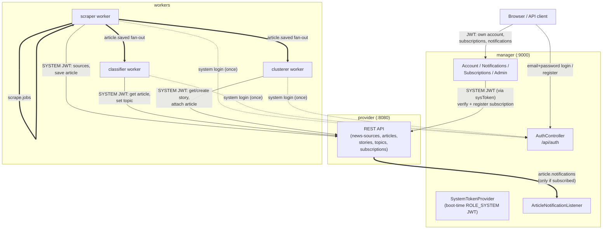

# Service Communication

How the three services in this system — **manager**, **provider**, and the **workers** — talk to each other: every HTTP call, every RabbitMQ message, and the auth tokens that gate them. This is the cross-cutting view; for the exhaustive per-endpoint/per-queue reference see:

- [`provider/PROVIDER_API.md`](provider/PROVIDER_API.md) — Provider's full REST reference, including its own auth matrix.
- [`manager/MANAGER_API.md`](manager/MANAGER_API.md) — Manager's full REST reference.
- [`documentation/RABBIT.md`](documentation/RABBIT.md) — RabbitMQ topology (exchanges, queues, bindings, message shapes).
- [`documentation/WORKER_DOCS.md`](documentation/WORKER_DOCS.md) — what each Python worker actually does.

## The three services

| Service | Tech | Default address | Role |
|---|---|---|---|
| **manager** | Spring Boot + Postgres | `http://localhost:9000/manager` | User-facing: accounts, auth, subscriptions, notifications. Sole **issuer** of JWTs. |
| **provider** | Spring Boot + Neo4j | `http://localhost:8080/news-provider` | System-of-record for sources/articles/stories/topics/subscriptions. JWT **validator** only — never issues tokens. |
| **workers** | Python (`scraper`, `classifier`, `clusterer`) | n/a (no inbound API) | Background pipeline: scrape → classify → cluster. Pure clients of manager (login only) and provider (everything else). |

Neither the provider nor the workers ever touch manager's Postgres database, and manager never touches Neo4j — the only integration points are the HTTP calls and RabbitMQ messages described below.

## Diagram

Solid arrows are HTTP (REST), double lines (`==>`) are RabbitMQ, dotted arrows are the one-time login call.

---

## Authentication & trust model

All three services share one HMAC-SHA256 secret (`jwt.secret` / `JWT_SECRET`, default `local-dev-jwt-signing-secret-please-change-me` — must be identical on manager **and** provider). **Manager is the only issuer**; provider only validates. There is no shared database or session store — trust is entirely carried in the signed JWT.

Three roles exist (`ROLE_USER`, `ROLE_ADMIN`, `ROLE_SYSTEM`), carried in the token's `roles` claim:

| Role | Who holds it | Granted via |
|---|---|---|
| `ROLE_USER` | End users | `POST /api/auth/register` on manager |
| `ROLE_ADMIN` | Human admins | Register with a valid admin code, or promoted later |
| `ROLE_SYSTEM` | Manager itself, and every worker | `POST /api/auth/login` on manager with `{"systemCode": "<shared secret>"}` and no password — no user profile attached, subject is the literal string `"system"` |

No token is ever minted for "provider" or "a worker" as an identity — they all authenticate as the same generic `ROLE_SYSTEM` principal. The queue name and REST endpoint being called are what actually scope what a `ROLE_SYSTEM` caller can do (see the per-endpoint role matrix in [`PROVIDER_API.md`](provider/PROVIDER_API.md#authentication)).

### Who logs in, and when

| Caller | Logs in against | When | What it does with the token |
|---|---|---|---|
| Browser/API client | manager `/api/auth/login` (email+password) or `/register` | Per user session | Sends as `Authorization: Bearer <token>` on every subsequent manager call |
| **manager itself** | *(no HTTP round-trip)* — `SystemTokenProvider` calls `JwtTokenProvider.generateToken()` directly, in-process | Once, at application startup | `WebConfig`'s `RestTemplate` interceptor stamps it onto every outbound call manager makes to the provider |
| **Each worker** (`provider_client.py`) | manager `/api/auth/login` (`systemCode`, real HTTP call — separate process) | Once, at `ProviderClient` construction | Cached on the `requests.Session`; re-sent on every Provider call |

Neither manager's nor the workers' `ROLE_SYSTEM` tokens are refreshed proactively. Manager's is generated once at boot for the process lifetime (per `jwt.expiration`, default 24h — a manager process that outlives that window will start getting `401`s from provider on subscription calls until restarted). Each worker re-authenticates transparently: if the provider ever answers `401` (expired/invalid token), `ProviderClient._request()` calls `_login()` again against manager and retries the call once before giving up.

### Why provider trusts a token it didn't issue

Provider has no `UserDetailsService`, no password store, no `/api/auth/*` — its `JwtAuthenticationFilter` only checks the signature against the shared secret and reads the `roles`/`subject` claims straight off the token (see `data.provider.security.JwtTokenValidator`). This works because manager and provider are deployed together and share one secret out-of-band (env var); if that secret is ever different between the two, every provider call from manager/workers will fail with `401` even though manager's own login endpoints work fine.

---

## HTTP communication

### 1. Browser/client → manager

Everything a human user does — register, log in, manage their own account, subscribe/unsubscribe, read notifications — goes through manager only. The client never talks to provider directly. Full reference: [`MANAGER_API.md`](manager/MANAGER_API.md).

### 2. manager → provider

Manager calls out to provider from exactly one place: `SubscriptionService`, when a user subscribes/unsubscribes to a topic or story. This is a **synchronous existence check + registration**, not a notification path.

| Manager endpoint (user-facing) | Provider call | Purpose |
|---|---|---|
| `POST /api/users/me/subscriptions` | `POST /api/subscriptions/story/{targetId}` or `/topic/{targetId}` | Verify the target exists in provider and register interest there. Provider `400` (target doesn't exist) is remapped to manager `404`; a transport failure becomes manager `502`. |
| `DELETE /api/users/me/subscriptions/{id}` | `DELETE /api/subscriptions/story/{targetId}` or `/topic/{targetId}` | Unregister interest in provider once the manager-side row is deleted. |

Both calls carry `Authorization: Bearer <system token>` via the `RestTemplate` interceptor in `WebConfig` — see [Authentication](#authentication--trust-model) above. Both endpoints require `ROLE_ADMIN` or `ROLE_SYSTEM` on the provider side, which the system token satisfies.

### 3. Workers → manager

The **only** thing any worker asks manager for is a token — `POST /api/auth/login` with `{"systemCode": "..."}`. Workers never call any other manager endpoint (no account/notification/subscription access) — see `workers/provider_client.py`'s `_login()`.

### 4. Workers → provider

This is the bulk of the system's HTTP traffic. All three workers go through the shared `provider_client.py`, and every call carries the worker's `ROLE_SYSTEM` bearer token.

| Worker | Provider calls |
|---|---|
| scraper | `GET /api/news-sources/{name}` (source config) · `PATCH /api/news-sources/{name}/failure` · `PATCH /api/news-sources/{name}/reset` · `GET /api/articles/exists` · `POST /api/articles` (save) |
| classifier | `GET /api/articles/by-url` (fetch title/body) · `PATCH /api/articles/topic` (write predicted topic — triggers a provider-side notification if subscribed) |
| clusterer | `GET /api/articles/by-url` · `GET /api/stories/recent` · `POST /api/stories` (create) · `PATCH /api/stories/{storyId}/attach` (triggers a notification if subscribed) |

All of these except the two `GET`s require `ROLE_ADMIN` or `ROLE_SYSTEM` (`POST /api/articles`, `PATCH /api/articles/topic`) or `ROLE_SYSTEM` specifically (`POST /api/stories`, `PATCH /api/stories/{storyId}/attach`) — the workers' system token covers all of it. Reads (`GET /api/news-sources/{name}`, `GET /api/articles/by-url`, `GET /api/stories/recent`) are public and would work even unauthenticated, but the token is sent regardless since it's set once on the session.

---

## RabbitMQ communication

Only two hops in the whole pipeline are asynchronous (everything else above is synchronous HTTP): the scraper's fan-out to classifier/clusterer, and provider's notification to manager. Full topology (exchanges, bindings, TTLs, dead-lettering) is in [`RABBIT.md`](documentation/RABBIT.md); summarized here from a "who talks to whom" angle:

| Queue | Producer | Consumer | Purpose |
|---|---|---|---|
| `scrape.jobs` | provider (`trigger-scrape` / 6h scheduler) + scraper worker (self-requeue on failure) | scraper worker | One job per news source to scrape. |
| `article.classify` | scraper worker (fanned out via `news_monitor` topic exchange, routing key `article.saved`) | classifier worker | "This article was just saved, go classify its topic." |
| `article.cluster` | scraper worker (same fan-out, same routing key) | clusterer worker | "This article was just saved, go cluster it into a story." |
| `article.notifications` | **provider only** | **manager only** (`ArticleNotificationListener`) | "A subscribed topic/story got a new article — go notify the subscribed users." |

`article.notifications` is the one queue that crosses from provider into manager; it is deliberately published straight to the queue name via RabbitMQ's default exchange (not through the `news_monitor` topic exchange) so it can never accidentally receive the scraper's fan-out traffic — see the isolation note in [`RABBIT.md`](documentation/RABBIT.md#isolation-of-articlenotifications). No worker ever binds to or consumes `article.notifications`, and manager never publishes to or consumes `scrape.jobs`/`article.classify`/`article.cluster` — the two message flows are fully partitioned by direction (scraper→classify/cluster workers vs. provider→manager).

---

## End-to-end walkthroughs

### A user subscribes to a topic

1. Client → manager: `POST /api/users/me/subscriptions` with the user's own JWT, body `{"type": "TOPIC", "targetId": "Politics"}`.
2. Manager → provider: `POST /api/subscriptions/topic/Politics`, authenticated with manager's boot-time system token. Provider creates (or increments) a `Subscription` node pointing at the `Politics` topic and returns `200`.
3. Manager inserts its own `Subscription` row (Postgres) and returns `201` to the client.

From this point on, provider knows a subscription exists for `Politics`; manager independently knows the user is subscribed to it. Neither side is aware of the other's storage — they're kept in sync only by steps 2–3 happening atomically enough that a provider failure surfaces as a `502` to the client instead of a silently-inconsistent state.

### An article gets classified and matches that subscription

1. Scraper worker saves a new article via `POST /api/articles` (provider), then publishes `{"url": ..., "source_name": ...}` to the `news_monitor` exchange with routing key `article.saved`.
2. The topic exchange fans that one publish out to both `article.classify` and `article.cluster`.
3. Classifier worker consumes `article.classify`, calls `GET /api/articles/by-url` then `PATCH /api/articles/topic` with `{"url": ..., "topic": "Politics"}`.
4. Provider's `ArticleService.setTopic` sets the topic, then checks `SubscriptionRepository.existsByTopicName("Politics")` — true, from the walkthrough above — and publishes `{"name": "Politics", "articleUrl": "...", "type": "TOPIC"}` to `article.notifications`.
5. Manager's `ArticleNotificationListener` consumes it, looks up every user subscribed to `("Politics", TOPIC)`, and inserts a `Notification` row for each.
6. The user eventually calls `GET /api/users/me/notifications` (manager) with their own JWT and sees it.

Clustering runs the identical flow independently off `article.cluster`, ending in a `STORY`-typed notification instead if the article attaches to a subscribed story.

---

## Failure modes worth knowing

- **Provider down:** workers retry each Provider call with backoff (`workers/retry.py`, 5 attempts / 60–240s) before nacking the message back to its queue and shutting the worker down — see [`WORKER_DOCS.md`](documentation/WORKER_DOCS.md#provider-outage-handling). Manager's subscribe/unsubscribe calls surface as `502 ExternalServiceException` to the client instead.
- **Manager down:** a worker that hasn't logged in yet (fresh process start) fails at construction. A worker that's already holding a valid token keeps working against provider until that token expires — manager being down only bites the *next* re-login (either a fresh worker process, or an existing one whose token just got a `401`).
- **Shared JWT secret drifts between manager and provider:** every provider call from manager or any worker starts failing `401` immediately, while manager's own login/register endpoints keep working fine (they don't depend on provider at all) — this is the most likely-to-be-confusing failure since manager looks completely healthy from the outside.
- **`article.notifications` never reaches manager:** notifications silently stop appearing for new articles, but subscribing/unsubscribing (the synchronous HTTP path) keeps working — the two are on independent transports, so one failing doesn't affect the other.
