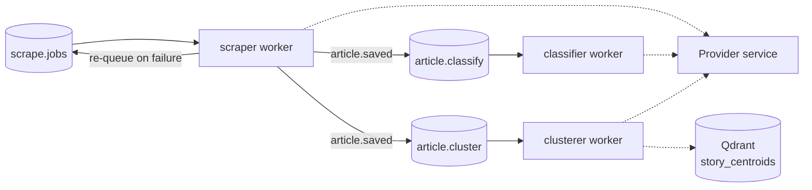

# Workers

Three independent Python processes under [`workers/`](workers/) do all the background processing for the pipeline: scraping articles, classifying their topic, and clustering them into stories. Each runs in its own virtualenv, consumes from its own RabbitMQ queue, and never touches Neo4j directly — all reads/writes go through the Provider service's REST API via the shared [`provider_client.py`](workers/provider_client.py). For queue/exchange wiring see [RABBIT.md](RABBIT.md); this doc covers what each worker actually does.

## Diagram



## Shared modules

| File                                                     | Purpose                                                                                                                                    |
| --------------------------------------------------------- | --------------------------------------------------------------------------------------------------------------------------------------------- |
| [`provider_client.py`](workers/provider_client.py)     | HTTP client for the Provider REST API. Raises `ProviderError` on any transport failure or unexpected status — the one exception all three workers treat as "provider unreachable." |
| [`retry.py`](workers/retry.py)                         | `call_with_retry()` — shared backoff helper (see [Provider-outage handling](#provider-outage-handling) below).                            |
| [`env_config.py`](workers/env_config.py)               | `require_env` / `require_int` / `require_float` — reads the repo-root `.env`, fails loudly on a missing variable instead of silently defaulting. |
| [`log_config.py`](workers/log_config.py)               | `configure_logging()` — shared colored console log format, one call per worker process.                                                  |

Run everything from `workers/` (the parent of `scraper/`, `classifier/`, `clusterer/`) so the packages and these shared modules all resolve on `sys.path` — see [`workers/Makefile`](workers/Makefile).

## Provider-outage handling

All three workers wrap their per-message handling in `call_with_retry()`: if the Provider is unreachable (`ProviderError`), the call is retried up to 5 times with linear backoff — 60s, 120s, 180s, 240s between attempts — using `connection.sleep()` (not `time.sleep()`) so the RabbitMQ heartbeat stays alive during the wait instead of the broker dropping the connection. If the 5th attempt still fails, the message is nacked back to its queue (`requeue=True`, so it isn't lost) and the worker shuts itself down via `stop_consuming()` — a Provider outage that long means there's nothing productive left for this process to do until it's restarted.

Any other unhandled exception during message processing is logged and the message is nacked for requeue, but the worker keeps running.

---

## Scraper worker

**Files:** [`scraper/scraper_worker.py`](workers/scraper/scraper_worker.py) (RabbitMQ entry point) · [`scraper/news_scraper.py`](workers/scraper/news_scraper.py) (fetch/extract/parse library) · [`scraper/playwright_fetch_worker.py`](workers/scraper/playwright_fetch_worker.py) (Playwright subprocess)

**Consumes:** `scrape.jobs` · **Publishes:** re-queues to `scrape.jobs` on failure, `article.saved` (routing key, fanned out to `article.classify` + `article.cluster`) on every saved article.

**Run:** `make scrape-worker` (from `workers/`)

### What it does

Each job on `scrape.jobs` names one news source (e.g. `{"name": "bbc"}`). For that job:

1. Looks up the source's config (base URL, RSS URL, disabled flag) from the Provider.
2. If the source is **disabled**, gets exactly one attempt — no re-queue either way. A success re-enables it (`reset_failures`).
3. If **enabled**, fetches the RSS/Atom feed (`parse_rss()`), skips URLs the Provider already has (`article_exists`), and for each new entry:
   - Fetches the article HTML via `SmartFetcher` (see below).
   - Extracts body text with `TrafilaturaExtractor`.
   - Saves it via the Provider (`save_article`).
   - Publishes `{"url": ..., "source_name": ...}` to `article.saved` so the classifier and clusterer pick it up independently.
4. On a feed-level failure (RSS unreachable/unparsable), increments the source's failure counter via the Provider and re-queues the job with an incremented `retry_count`, up to `SCRAPE_MAX_ATTEMPTS`. Individual article failures are logged and skipped — they don't fail the whole source.

### Fetch strategy (`SmartFetcher`)

Tries, in order, until one returns enough extracted text (`JS_MIN_CHARS`):

1. Static HTTP fetch with the bot user-agent (`USER_AGENT`) — fast, works for most sites.
2. Static HTTP fetch with a browser user-agent (`BROWSER_USER_AGENT`) — bypasses UA-based bot blocks (e.g. CBC, NPR — see `RSS_BROWSER_UA_SOURCES` for feeds that need this too).
3. Headless Chromium via Playwright, run in a **fresh subprocess** per fetch (`playwright_fetch_worker.py`) rather than in-process — pika's blocking connection already runs its own asyncio loop, and two independent asyncio setups sharing a process was observed to break Playwright's dispatcher after the consumer had been running a while.

`HttpFetcher` retries on transient failures and honors `Retry-After` on HTTP 429 (capped by `MAX_RETRY_SLEEP`). `robots.txt` is fetched with a timeout and fails **open** (allow) on error or 4xx, so a robots.txt hiccup never silently kills an entire source; `Crawl-delay` is respected if stricter than `RATE_LIMIT_SECONDS`.

### Key environment variables

| Variable                                          | Meaning                                                        |
| -------------------------------------------------- | ---------------------------------------------------------------- |
| `SCRAPE_MAX_ATTEMPTS`                            | Re-queue cap per job (matches the Provider's own auto-disable threshold). |
| `RSS_BROWSER_UA_SOURCES`                         | Comma-separated source names whose RSS feed needs the browser UA. |
| `USER_AGENT` / `BROWSER_USER_AGENT`              | Bot vs. browser identities used by the fetch strategy above.   |
| `RATE_LIMIT_SECONDS`                             | Delay between requests to the same source.                    |
| `MAX_RETRIES` / `RETRY_BACKOFF` / `MAX_RETRY_SLEEP` | `HttpFetcher`'s own retry/backoff, independent of the Provider-outage retry in [retry.py](workers/retry.py). |
| `JS_LOAD_WAIT_MS` / `JS_MIN_CHARS`               | How long Playwright waits after `domcontentloaded`, and the extracted-text length below which `SmartFetcher` falls through to the next strategy. |

---

## Classifier worker

**Files:** [`classifier/classifier_worker.py`](workers/classifier/classifier_worker.py) (RabbitMQ entry point) · [`classifier/classifier.py`](workers/classifier/classifier.py) (`NewsClassifier` model wrapper) · [`classifier/cls_model_output/`](workers/classifier/cls_model_output) (fine-tuned model weights + `label2id.json`)

**Consumes:** `article.classify` (same `article.saved` fan-out the clusterer worker consumes independently)

**Run:** `make classify-worker` (from `workers/`)

### What it does

For each message (`{"url": ..., "source_name": ...}`):

1. Fetches the article's title + body text from the Provider (`get_article`). Drops the message if the article isn't found.
2. Classifies `f"{title}\n\n{body_text}"` with the fine-tuned `NewsClassifier` singleton (86% accuracy vs. 52% for a LogisticRegression baseline).
3. Writes the predicted topic back via `PATCH /api/articles/topic`.

The model (`AutoModelForSequenceClassification`, loaded from `cls_model_output/`) and its `label2id.json` mapping load once, lazily, on first use via `NewsClassifier.get_instance()` — not at import time, so importing the module elsewhere (e.g. tests) doesn't pay the model-load cost.

This worker only assigns topic — it never touches Story/embedding logic, which is the clusterer's job.

---

## Clusterer worker

**Files:** [`clusterer/clusterer_worker.py`](workers/clusterer/clusterer_worker.py) (RabbitMQ entry point) · [`clusterer/embedder.py`](workers/clusterer/embedder.py) (`ArticleEmbedder` model wrapper) · [`clusterer/data/`](workers/clusterer/data) (offline embedding-model validation — see [CLUSTERING_VALIDATION.md](CLUSTERING_VALIDATION.md))

**Consumes:** `article.cluster` (same `article.saved` fan-out the classifier worker consumes independently) · **Vector store:** Qdrant collection `story_centroids` (`CENTROID_COLLECTION`)

**Run:** `make cluster-worker` (from `workers/`)

### What it does

For each message (`{"url": ..., "source_name": ...}`):

1. Fetches the article's title + body text from the Provider. Drops the message if not found.
2. Embeds `f"{title}\n\n{body_text}"` (truncated to `MAX_EMBED_CHARS` — the model has no automatic truncation for inputs this short of its max sequence length, and an unusually long scraped article can otherwise drive quadratic self-attention memory usage into the tens of GB) with the `ArticleEmbedder` singleton (`sentence-transformers/all-MiniLM-L6-v2`, 384-dim, normalized so cosine similarity reduces to a dot product).
3. Queries `story_centroids` for the nearest centroid whose `lastUpdated` falls within `RECENCY_WINDOW_DAYS`.
4. **If the best match's score ≥ `SIMILARITY_THRESHOLD`:** attaches the article to that Story via the Provider and updates the centroid as a running average, weighted by the story's existing `articleCount` (Qdrant first — the update is an idempotent upsert-by-ID, cheap to retry).
5. **Otherwise** (including the very first article ever — no special-casing needed): creates a new Story via the Provider (Provider first here, since Story IDs are server-generated and there's no ID to seed a centroid point under until the Provider assigns one), then seeds its centroid in Qdrant with `articleCount=1`.

`ensure_collection()` runs on every worker startup — idempotent, creates the `story_centroids` collection (cosine distance, `EMBEDDING_DIM`) and its `lastUpdated` payload index if they don't already exist (the index is required before that field can be used in a query filter).

### Key environment variables

| Variable                 | Meaning                                                                                     |
| -------------------------- | ----------------------------------------------------------------------------------------------- |
| `QDRANT_URL` / `QDRANT_API_KEY` | Qdrant Cloud connection. Client is created with `check_compatibility=False` since Qdrant Cloud's server version can run ahead of the newest `qdrant-client` release on PyPI. |
| `EMBEDDING_MODEL_NAME`   | Sentence-transformers model to load — must match `EMBEDDING_DIM`.                           |
| `EMBEDDING_DIM`           | Vector size for the Qdrant collection; a mismatch with the model's actual output fails loudly at collection-creation time. |
| `SIMILARITY_THRESHOLD`   | Attach-vs-create cutoff, chosen from the validation runs in `clusterer/data/` (see [CLUSTERING_VALIDATION.md](CLUSTERING_VALIDATION.md)). |
| `RECENCY_WINDOW_DAYS`    | How far back a centroid can be and still be considered a candidate match.                   |
| `MAX_EMBED_CHARS`        | Input truncation before embedding (see step 2 above).                                       |
| `CENTROID_COLLECTION`    | Qdrant collection name (`story_centroids`).                                                  |

To wipe and recreate the collection from scratch: `make qdrant-purge` (destructive — recreated automatically the next time the clusterer worker starts).

---

## Setup

```sh
cd workers
make setup              # creates all three venvs, installs deps, installs Playwright's Chromium
# or individually: make setup-scraper / setup-classifier / setup-clusterer
```

Each worker's dependencies are pinned in its own `requirements.txt` ([scraper](workers/scraper/requirements.txt), [classifier](workers/classifier/requirements.txt), [clusterer](workers/clusterer/requirements.txt)) and installed into its own `venv/` — kept separate since `torch`/`transformers`/`sentence-transformers` are heavy and versioned independently per worker.
